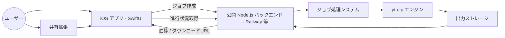

# Fetchy


Fetchy は Node.js バックエンドと `yt-dlp` を利用した、モダンな iOS
向け動画ダウンローダーです。

Fetchy は重い処理をサーバー側へオフロードすることで、iOS
アプリを軽量・高速・省バッテリーに保ちながら、シームレスなダウンロード体験を提供します。

------------------------------------------------------------------------

## 📐 アーキテクチャ図



------------------------------------------------------------------------

## 🧠 Fetchy を作った理由

多くのモバイルダウンローダーアプリは、メディア処理を端末上で実行します。

Fetchy は次の設計思想を実験的に採用しています。

-   CPU 負荷の高い処理をバックエンドへ移動
-   バッテリー消費の削減
-   高い UI 応答性の維持
-   アプリ更新なしでバックエンドを改善可能

------------------------------------------------------------------------

## 🌍 公開バックエンド

Fetchy は現在 Railway 上にホストされた公開バックエンドを使用しています。

このバックエンドは次の目的で公開されています。

-   実環境での利用状況の観察
-   動画処理ワークロードのスケーリング検証
-   セキュリティおよび不正利用対策の評価

将来的な改善予定：

-   レート制限
-   認証機能
-   利用量制限

------------------------------------------------------------------------

## 📦 インストール (IPA)

Fetchy は GitHub Releases から IPA として配布されています。

👉 https://github.com/nisesimadao/Fetchy/releases

以下のツールでインストールできます：

-   AltStore
-   SideStore
-   TrollStore（対応端末のみ）

------------------------------------------------------------------------

## 🖼️ スクリーンショット


------------------------------------------------------------------------

## ✨ 主な機能

-   **サーバーサイド処理**：`yt-dlp` 実行をバックエンドで処理
-   **幅広いサイト対応**：`yt-dlp` により数百サイトに対応
-   **リアルタイム進行状況表示**
-   **詳細なダウンロード設定**
-   **SwiftUI によるネイティブ UI**
-   **共有シート拡張対応**
-   **非同期ジョブ設計**

------------------------------------------------------------------------

## 🏗️ アーキテクチャ

Fetchy は UI
と動画処理を分離するクライアント・サーバー構成を採用しています。

1.  iOS アプリまたは共有拡張から URL を入力
2.  Node.js バックエンドへダウンロード要求
3.  サーバーがジョブ ID を生成し `yt-dlp` を実行
4.  アプリが進行状況をポーリング
5.  完了後にファイルをダウンロード

------------------------------------------------------------------------

## 🛠️ 技術スタック

-   クライアント：SwiftUI
-   サーバー：Node.js / Express.js
-   コア依存：yt-dlp

------------------------------------------------------------------------

## 🚀 セットアップ

### バックエンド

``` bash
cd fetchy-api
npm install
npm start
```

Railway、Render、Heroku など任意の Node.js ホスティングで運用可能です。

------------------------------------------------------------------------

### iOS アプリ

``` bash
open Fetchy.xcodeproj
```

次のファイルでバックエンド URL を変更：

    Fetchy/Shared/Managers/APIClient.swift

``` swift
private let baseURL = "https://your-backend-service-url.com"
```

------------------------------------------------------------------------

## 🔐 法的注意

Fetchy は技術デモとして提供されています。

利用者は以下を遵守する責任があります：

-   各プラットフォームの利用規約
-   著作権法
-   各国・地域の法令

------------------------------------------------------------------------

## ❤️ コントリビューション

Pull Request・Issue 大歓迎です！

------------------------------------------------------------------------

## 📄 ライセンス

[MIT License](LICENSE)
