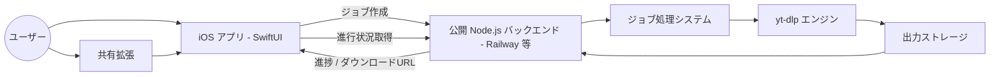

# Fetchy


Fetchy は、Node.js バックエンドと `yt-dlp` を利用する iOS 向け動画ダウンローダーです。
動画処理をサーバー側で実行し、iOS アプリはジョブの作成、進捗確認、完成したファイルの取得を担当します。

## 📐 アーキテクチャ


```mermaid
flowchart LR

User((ユーザー))
App[iOS アプリ - SwiftUI]
Share[共有拡張]
Backend[公開 Node.js バックエンド - Railway 等]
Queue[ジョブ処理システム]
YTDLP[yt-dlp エンジン]
Storage[出力ストレージ]

User --> App
User --> Share
Share --> App

App -->|ジョブ作成| Backend
App -->|進行状況取得| Backend

Backend --> Queue
Queue --> YTDLP
YTDLP --> Storage
Storage --> Backend
Backend -->|進捗 / ダウンロードURL| App
```

## 🧠 設計方針

一般的なモバイル向けダウンローダーには、メディア処理を端末上で実行するものがあります。
Fetchy は、CPU 負荷の高い処理をバックエンドへ移す構成を採用しています。

この構成には、次の狙いがあります。

- iOS 端末側の CPU 負荷を抑える。
- メディア処理中のバッテリー消費を抑える。
- UI の応答性を保つ。
- アプリ本体を更新せず、バックエンド側の処理を変更できるようにする。

## 🌍 公開バックエンド

Fetchy は現在、Railway 上にホストした公開バックエンドを使用しています。
このバックエンドは、次の検証にも利用しています。

- 実環境での利用状況の確認。
- 動画処理ワークロードのスケーリング検証。
- セキュリティ対策と不正利用対策の評価。

今後は、レート制限、認証、利用量制限の追加を予定しています。

## 📦 インストール（IPA）

Fetchy は GitHub Releases から IPA として配布しています。

https://github.com/nisesimadao/Fetchy/releases

次のツールでインストールできます。

- AltStore
- SideStore
- TrollStore（対応端末のみ）

## 🖼️ スクリーンショット


## ✨ 主な機能

- **サーバー側の処理**：`yt-dlp` はバックエンドで実行します。
- **複数サイトへの対応**：`yt-dlp` が対応するサイトを利用できます。
- **進捗表示**：ダウンロード処理の進行状況を表示します。
- **ダウンロード設定**：出力条件を指定できます。
- **ネイティブ UI**：SwiftUI で実装しています。
- **共有拡張**：iOS の共有シートから URL を渡せます。
- **非同期ジョブ**：サーバー側の処理をジョブとして管理します。

## 🏗️ 処理の流れ

Fetchy は、UI と動画処理を分離したクライアント・サーバー構成です。

1. iOS アプリまたは共有拡張から URL を入力します。
2. Node.js バックエンドへダウンロード要求を送ります。
3. サーバーがジョブ ID を発行し、`yt-dlp` を実行します。
4. アプリが処理状況を定期的に取得します。
5. 処理完了後、生成されたファイルをダウンロードします。

## 🛠️ 技術スタック

- クライアント：SwiftUI
- サーバー：Node.js / Express.js
- コア依存：`yt-dlp`

## 🚀 セットアップ

### バックエンド

```bash
cd fetchy-api
npm install
npm start
```

Railway、Render、Heroku など、Node.js を実行できるホスティング環境で運用できます。

### iOS アプリ

```bash
open Fetchy.xcodeproj
```

バックエンド URL は、次のファイルで変更します。

```text
Fetchy/Shared/Managers/APIClient.swift
```

```swift
private let baseURL = "https://your-backend-service-url.com"
```

## 🔐 利用上の注意

Fetchy は技術デモとして提供しています。
利用者は、対象プラットフォームの利用規約、著作権法、各国または地域の法令に従って利用してください。

## ❤️ コントリビューション

Issue と Pull Request を受け付けています。

## 📄 ライセンス

[MIT License](LICENSE)
