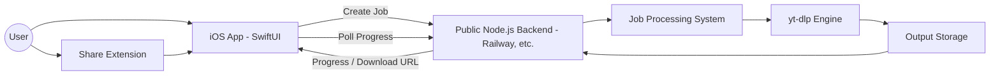

# Fetchy


Fetchy is an iOS video downloader backed by Node.js and `yt-dlp`.
The iOS app handles job creation, progress reporting, and file retrieval, while the server performs media processing.

*Supports iOS 15.6+.*

[日本語 README](README-jp.md)

## 📐 Architecture



## 🧠 Design

Many mobile downloaders perform media processing on the device.
Fetchy moves CPU-intensive work to the backend instead.

This design aims to:

- reduce CPU load on the iOS device;
- reduce battery use during media processing;
- keep the interface responsive; and
- allow backend processing changes without requiring an app update.

## 🌍 Public Backend

Fetchy currently uses a publicly accessible backend hosted on Railway.
The public deployment is also used to evaluate real-world behavior, workload scaling, and abuse-prevention measures.

Planned improvements include rate limiting, authentication, and usage quotas.

## 📦 Installation (IPA)

Fetchy is distributed as an IPA through [GitHub Releases](https://github.com/nisesimadao/Fetchy/releases).

It can be installed with:

- AltStore;
- SideStore; or
- TrollStore on supported devices.

## 🖼️ Screenshots


## ✨ Features

- **Server-side processing**: the backend runs `yt-dlp` instead of the iOS device.
- **Broad site support**: supported sites are determined by `yt-dlp`.
- **Progress reporting**: the app polls the backend for job status and updates the UI.
- **Download options**: quality, format, metadata embedding, and related options can be configured.
- **Native SwiftUI interface**: the iOS client is implemented in SwiftUI.
- **Share Extension**: URLs can be sent to Fetchy from the iOS Share Sheet.
- **Asynchronous jobs**: server work is represented as jobs so the client does not block while processing continues.

## 🏗️ Request Flow

1. The user provides a video URL in the app or Share Extension.
2. The client sends a download request to the Node.js backend.
3. The server creates a job ID and starts `yt-dlp` processing.
4. The client polls `/api/status/:jobId` for progress.
5. After processing finishes, the client downloads the resulting file from `/api/download/:jobId`.

```text
+------------------+           +----------------------+           +----------------+
| iOS App (Client) | --(1)-->  | Node.js API (Server) | --(2)-->  | yt-dlp Process |
|                  | <-- JobID--|                      |           |                |
|                  |           |                      |           +----------------+
|   polls status   | --(3)-->  |  (manages job)       |
|                  | <--progress|                      |
|                  |           |                      |
| downloads file   | --(4)-->  |  (serves file)       |
+------------------+           +----------------------+
```

## 🛠️ Tech Stack

- **Client**: SwiftUI
- **Backend**: Node.js / Express.js
- **Core dependency**: `yt-dlp`

## 🚀 Setup

### Backend

```bash
cd fetchy-api
npm install
npm start
```

The backend can run on Railway, Render, Heroku, or another Node.js hosting provider.

### iOS App

Open the Xcode project:

```bash
open Fetchy.xcodeproj
```

Set the backend URL in:

```text
Fetchy/Shared/Managers/APIClient.swift
```

```swift
private let baseURL = "https://your-backend-service-url.com"
```

Then build and run the app from Xcode.

## 🔐 Usage Notice

Fetchy is provided as a technical demonstration.
Users are responsible for complying with the terms of the source platform, applicable copyright law, and local regulations.

## ❤️ Contributing

Issues and pull requests are welcome.

## 📄 License

[MIT License](LICENSE)
